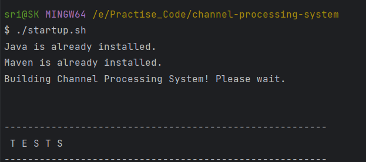
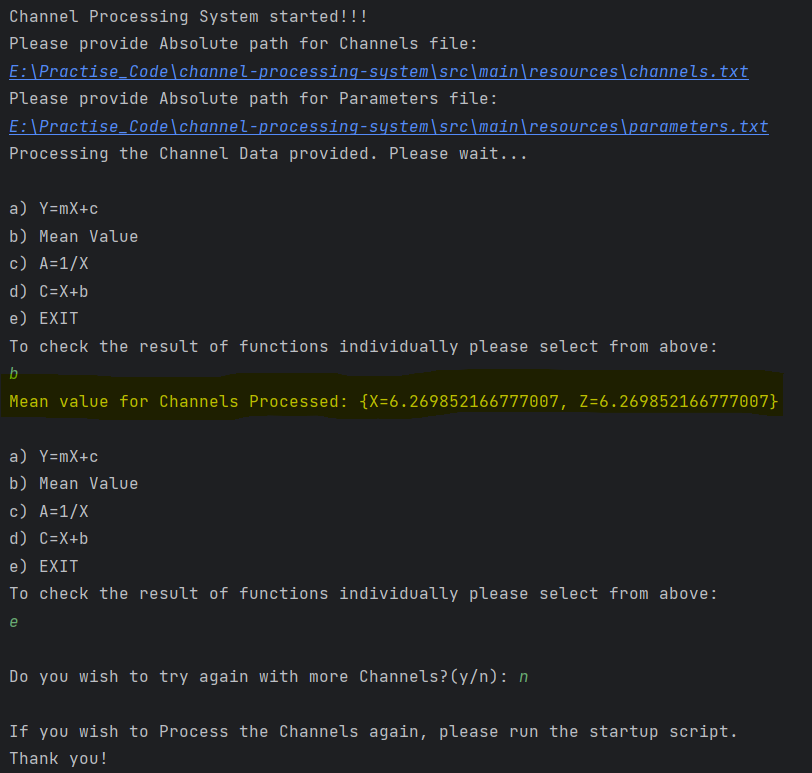

# **Channel Processing System!!!**
This application was designed in Java.

To start this application, please run the startup.sh script provided in base directory.

This startup.sh script basically checks for Java & Maven installations. If the installations are not found, then this script seeks permission to install Java & Maven.

If Java & Maven installations are already available, then this script starts maven build if target folder is not available.

Application will be started once the build is done.

# **After Application starts...**

This application is designed to read channels and parameters files in text format. Similar to the files provided to test this app.

Need to provide the Absolute paths of the channels.txt and parameters.txt files.

Once the files are successfully processed, user will be provided with options to see the results of each function as in picture below:

And the user will be prompted(y/n) to process more Channels. If yes, the app starts from the scratch and processes the data provided.

# **Info:**
Application is already designed to accept multiple Channels and parameters data from the text files.

As in the above picture when option b is selected to display Mean values, the output displays mean values for 2 channels which were read from the same text file.

The text files are provided in resources of the application for reference.